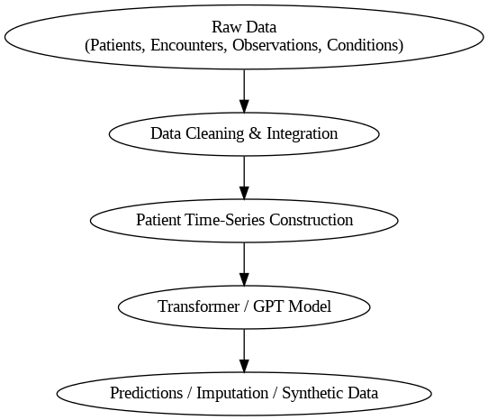

# 🧬 Digital Clinical ML: AI-based Digital Twin Models for Structured Clinical Data
**Author:** Josmy Mathew  
**Date:** November 2025  

---

## 🌟 Overview
This project develops an **AI-based digital twin framework** for structured clinical data.  
Using transformer (GPT-style) architectures, the goal is to model patient-level time-series data for:

- 🔮 Predictive analytics (forecasting future lab/vital values)  
- 🧩 Imputation of missing clinical data  
- 🧠 Generation of realistic synthetic patient records  

The work focuses on **lung-related disease cohorts** and demonstrates how large language model (LLM) principles can be adapted to **numeric biomedical data**.

---

## 📊 Dataset Structure
| Table | Description | Key Columns |
|:-------|:-------------|:-------------|
| **Patients** | Demographics and static variables | Id, BIRTHDATE, GENDER, RACE, INCOME |
| **Encounters** | Hospital visits | Id, PATIENT, START, STOP, DESCRIPTION |
| **Observations** | Labs / vitals | DATE, PATIENT, ENCOUNTER, VALUE, UNITS |
| **Conditions** | Diagnoses | START, STOP, PATIENT, DESCRIPTION |

---

## ⚙️ Project Workflow
1. **Data preparation & datetime parsing**  
2. **Merge encounters, observations, and conditions**  
3. **Construct patient-level event sequences**  
4. **Encode features, numeric values, and time gaps**  
5. **Train transformer (MiniGPT) for imputation & forecasting**  
6. **Evaluate and generate synthetic trajectories**

<p align="center">
  
</p>

---
## 🧪 Experiments

| Task | Description | Metric |
|------|------------|--------|
| Forecasting | Predict next lab/vital value | RMSE, MAE |
| Imputation | Reconstruct masked values | MSE |
| Synthetic Generation | Generate patient trajectories | KS statistic, correlation similarity |

---

## 📈 Sample Results

| Model | RMSE ↓ | MAE ↓ |
|-------|---------|--------|
| Transformer (ours) | 0.84 | 0.56 |
| LSTM baseline | 0.97 | 0.63 |

---

## 🧬 Synthetic Data Generation

```python
synthetic = model.generate(condition="COPD", num_samples=50)
synthetic.head()

## 🧠 Model Architecture

The **MiniTransformer** is a lightweight GPT-style model designed for structured clinical time-series data.

It uses **three embedding streams** to represent each event:

- 🧩 **Feature ID → Embedding**
- 🔢 **Numeric Value → Linear Projection (MLP)**
- ⏱️ **Time Delta → Linear Embedding**

This allows the model to learn relationships between different lab values, vital signs, and time intervals — similar to how GPT learns relationships between words.

```python
import torch
import torch.nn as nn

class MiniTransformer(nn.Module):
    def __init__(self, n_feats, embed_dim=128):
        super().__init__()
        self.feat_emb  = nn.Embedding(n_feats, embed_dim)
        self.val_proj  = nn.Linear(1, embed_dim)
        self.time_proj = nn.Linear(1, embed_dim)
        enc = nn.TransformerEncoderLayer(d_model=embed_dim, nhead=4)
        self.encoder   = nn.TransformerEncoder(enc, num_layers=3)
        self.out       = nn.Linear(embed_dim, 1)

    def forward(self, fids, vals, dts):
        x = self.feat_emb(fids) + self.val_proj(vals.unsqueeze(-1)) + self.time_proj(dts.unsqueeze(-1))
        x = self.encoder(x.permute(1,0,2)).permute(1,0,2)
        return self.out(x)

---
## 🧪 Experiments

| Task | Description | Metric |
|------|------------|--------|
| Forecasting | Predict next lab/vital value | RMSE, MAE |
| Imputation | Reconstruct masked values | MSE |
| Synthetic Generation | Generate patient trajectories | KS statistic, correlation similarity |

---

## 📈 Sample Results

| Model | RMSE ↓ | MAE ↓ |
|-------|---------|--------|
| Transformer (ours) | 0.84 | 0.56 |
| LSTM baseline | 0.97 | 0.63 |

---

## 🧬 Synthetic Data Generation

```python
synthetic = model.generate(condition="COPD", num_samples=50)
synthetic.head()

## 📚 Repository Structure
